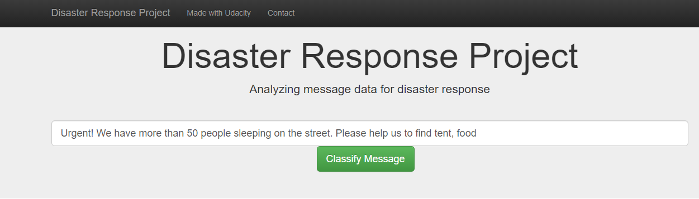
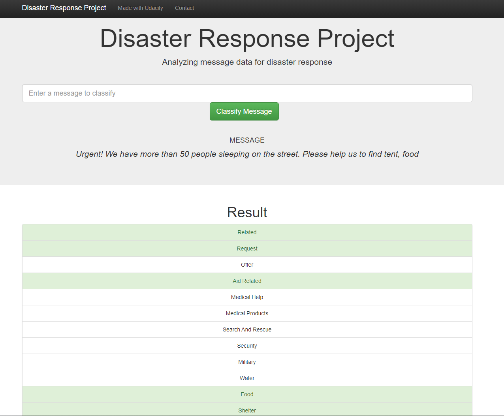
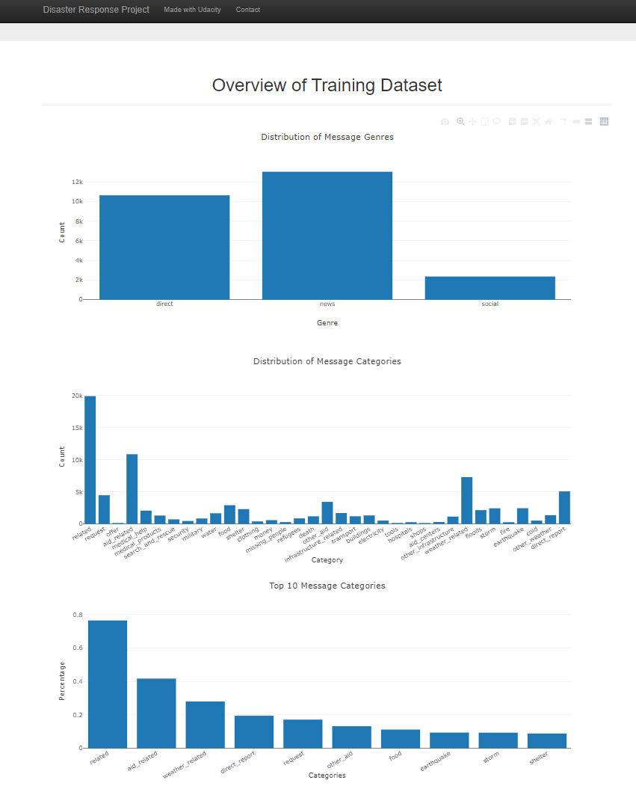

# Disaster-Response-Message-Classification-NLP-Pipelines

### Table of Contents

1. [Description](#description)
2. [Files](#files)
3. [Getting Started](#getting_started)
	1. [Dependencies](#dependencies)
	2. [Installation](#installation)
	3. [Executing Program](#execution)
4. [Author](#author)
5. [License](#license)
6. [Acknowledgement](#acknowledgement)
7. [Screenshots](#screenshots)

## Description <a name="description"></a>

This Project is part of the Data Science Nanodegree Program by Udacity in collaboration with [Appen (previously known as Figure Eight)](https://appen.com/). The initial dataset contains pre-labelled tweet and messages from real-life disaster. This dataset contains 30,000 messages drawn from events including an earthquake in Haiti in 2010, an earthquake in Chile in 2010, floods in Pakistan in 2010, super-storm Sandy in the U.S.A. in 2012, and news articles spanning a large number of years and 100s of different disasters. It can be downloaded [here](https://appen.com/datasets/combined-disaster-response-data/).

The data has been encoded with 36 different categories related to disaster response. These messages are sorted into specific categories such as Water, Hospitals, Aid-Related, that are specifically aimed at helping emergency personnel in their aid efforts. The aim of the project is to build a Natural Language Processing tool that can help emergency workers to analyze incoming messages and sort them into specific categories to speed up aid.

This project is divided in the following key sections:

1. ETL pipeline for data pre-processing and cleaning. Data is saved into SQLite DB
2. Machine Learning pipeline for text classification
3. Web App to show model results in real time


## Files<a name="files"></a>
```.
├── app     
│   ├── run.py                           # Flask file to runs app
│   └── templates   
│       ├── go.html                      # Classification result page of web app
│       └── master.html                  # Main page of web app   
├── data                   
│   ├── disaster_categories.csv          # Dataset including all the categories  
│   ├── disaster_messages.csv            # Dataset including all the messages
│   └── process_data.py                  # Data cleaning pipeline
├── models
│   └── train_classifier.py              # Train, save and store ML model           
└── README.md
```


## Getting Started <a name="getting_started"></a>


<a name="dependencies"></a>
### Dependencies
* Python 3.5+ 
* Machine Learning Libraries: NumPy, SciPy, Pandas, Scikit-Learn
* Natural Language Processing Library: NLTK
* SQLlite Database Library: SQLalchemy
* Model Loading and Saving: Pickle
* Web App and Data Visualization: Flask, Plotly

<a name="installation"></a>
### Installation
Clone the repo:
```
git clone https://github.com/EavenK/Disaster-Response-Message-Classification-NLP-Pipelines.git

```
<a name="execution"></a>
### Executing Program:
1. Run the following commands in the project's directory to set up your database, train and save the model.

    - To run ETL pipeline and store cleaned data in the db
        >`python data/process_data.py data/disaster_messages.csv data/disaster_categories.csv data/DisasterResponse.db`
    - To run the ML pipeline to load data from db, train and save classifier as pickle file (Model training takes around 30 minutes)
        >`python models/train_classifier.py data/DisasterResponse.db models/classifier.pkl`

2. Run the following command in the app's directory to run your web app.
    >`python run.py`

3. Go to `http://0.0.0.0:3001/` or go to `http://localhost:3001/`


## Author<a name="authors"></a>

* [Eaven Khaw](https://github.com/EavenK)

## License<a name="license"></a>
[](https://opensource.org/licenses/MIT)

## Acknowledgements<a name="acknowledgement"></a>

* [Udacity](https://www.udacity.com/) as hosts of the Data Science Nanodegree Program
* [Appen](https://appen.com/) for providing the relevant dataset

## Screenshots<a name="screenshots"></a>
1. This is an example of a message that you can type to test Machine Learning model performance



2. After clicking **Classify Message**, you can see the categories which the message belongs to highlighted in green



3. The main page shows some graphs about the training dataset, provided by Figure Eight


